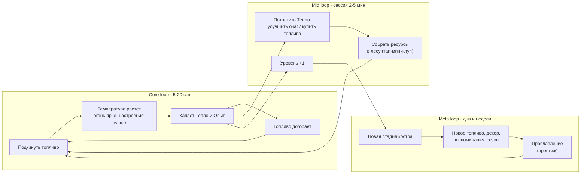
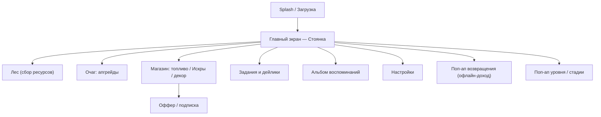
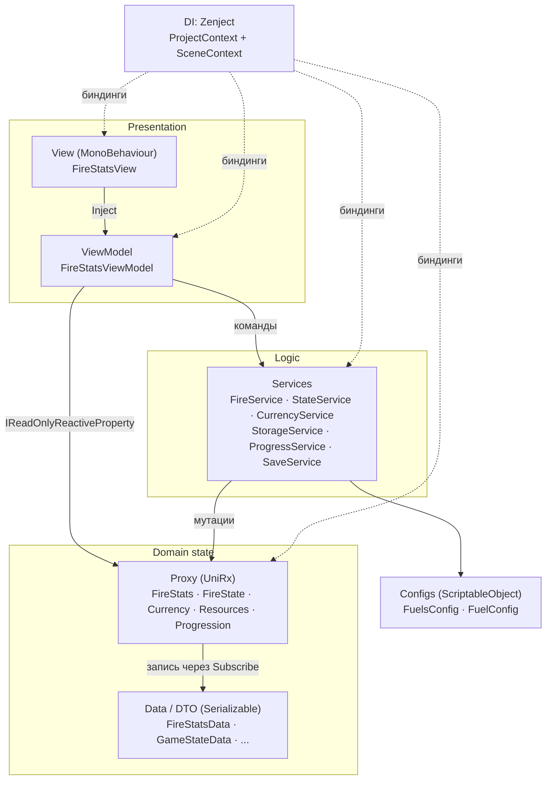

# GentleFlame — Game Design Document

> **Кодовое имя:** GentleFlame
> **Жанр:** Cozy Idle / Virtual Companion (уютный тайкун-питомец)
> **Платформы:** Android (первично), iOS (вторая волна)
> **Модель:** F2P — rewarded-реклама + IAP + подписка
> **Движок:** Unity 6000.3.6f1, URP 2D

| Поле | Значение |
|---|---|
| Версия документа | 1.0 |
| Дата | 2026-08-18 |
| Статус | Draft for review |
| Владелец документа | Product Manager |
| Аудитория | Разработка, арт, звук, маркетинг, инвесторы/издатель |
| Регламент обновления | Раздел «живой»: правки через PR в `Docs/`, ревью владельца, changelog внизу |

### Как читать документ

Документ модульный: разделы 1–3 — «зачем и для кого» (продукт и рынок), 4–7 — «что играем» (геймдизайн),
8–10 — «как это выглядит и ощущается» (арт, звук, UX), 11 — «как это устроено» (техника),
12–14 — «как это зарабатывает и живёт» (бизнес, LiveOps, аналитика), 15–18 — «как это делается» (план, риски, приложения).

Каждая фича помечена статусом реализации:

| Метка | Значение |
|---|---|
| ✅ | Реализовано в коде на момент написания |
| 🟡 | Частично реализовано / есть заглушка |
| ⬜ | Спроектировано, не реализовано |
| 🔬 | Гипотеза, требует проверки на игроках |

---

## 1. Executive Summary (одностраничник)

### 1.1 High concept

> **GentleFlame — это маленький живой огонёк, который живёт в твоём телефоне.
> Ты подкидываешь ему хворост, он греется, растёт и меняет настроение — и никогда не умирает окончательно.**

Игрок — Хранитель Огня. Основное действие — подбросить топливо в очаг. Огонь имеет температуру,
запас топлива и **характер**: он радуется, грустит, засыпает и вдохновляется в зависимости от того,
как о нём заботятся. За время горения игрок получает **Тепло** — мягкую валюту, которая тратится на
улучшение очага, новые виды топлива, декор стоянки и открытие следующих стадий костра
(Солома → Костерок → Очаг → Костёр → Вечный огонь).

### 1.2 Лог-лайн для стора

*«Разожги свой огонёк. Подкинь хвороста, послушай треск дров и смотри, как он растёт.
Тихая игра, в которой нельзя проиграть.»*

### 1.3 Ключевые параметры продукта

| Параметр | Значение |
|---|---|
| Жанр | Cozy Idle / Incremental + Virtual Pet |
| Референс-микс | Cats & Soup × Tsuki's Odyssey × Finch × Campfire Idle |
| Целевая аудитория | 25–40 лет, 55–65% женщины, «anti-stress» игроки |
| Платформа v1.0 | Android 7.1+ (minSdk 25), портрет |
| Ориентация | Портрет, одна рука ⚠️ *сейчас в проекте стоит AutoRotation — нужно зафиксировать* |
| Длина сессии | 2–5 минут |
| Сессий в день | 4–7 |
| Онлайн | Не требуется (офлайн-first), сеть — для рекламы/IAP/аналитики |
| Бизнес-модель | Rewarded video + IAP + подписка «Хранитель огня» |
| Размер сборки | ≤ 120 МБ (цель ≤ 80 МБ) |
| Локализация v1.0 | RU, EN |

### 1.4 USP — почему играют именно в это

1. **Огонь как персонаж, а не как счётчик.** У пламени пять настроений и живая мимика/анимация;
   оно реагирует на заботу, а не только растёт в числах. Это отличает продукт от «голых» кликеров про костёр.
2. **Тепловая инерция вместо мгновенного отклика.** Температура догоняет целевую плавно —
   получается ощущение живого материала, а не полоски прогресса. Это ядро тактильного удовольствия.
3. **Игра, в которой нельзя проиграть.** Огонь не гаснет насовсем — он уходит в тлеющие угли и
   ждёт возвращения. Ноль наказаний за отсутствие = ключевое обещание cozy-жанра.
4. **Сенсорика на первом месте.** Треск, искры, гаптика при подкидывании дров, адаптивная музыка,
   меняющаяся вместе с яркостью пламени.
5. **Этичная монетизация.** Никаких таймеров-вымогателей, energy-систем и pay-to-progress;
   деньги — за комфорт, косметику и ускорение, а не за право играть.

### 1.5 Критерии успеха (цели soft launch)

| Метрика | Порог провала | Цель | Отлично |
|---|---|---|---|
| D1 retention | < 25% | 32% | 38%+ |
| D7 retention | < 8% | 14% | 18%+ |
| D30 retention | < 3% | 6% | 9%+ |
| Средняя длина сессии | < 90 с | 3 мин | 4.5 мин |
| Сессий/DAU в день | < 2.5 | 4.5 | 6+ |
| ARPDAU (blended) | < $0.03 | $0.10 | $0.18+ |
| RV/DAU (просмотров на юзера) | < 1.5 | 3.5 | 5+ |
| Конверсия в IAP (D30) | < 0.8% | 2.0% | 3.5%+ |
| Crash-free sessions | < 99% | 99.6% | 99.9% |

### 1.6 Текущий статус проекта (на 2026-08-18)

Проект находится на стадии **раннего прототипа**. Собран технический скелет:

* ✅ Слоистая архитектура Data (DTO) → Proxy (реактив) → Service (логика) → ViewModel → View
* ✅ Реактивные обёртки на UniRx, DI на Zenject, асинхронный тикер на UniTask
* ✅ Модель огня: топливо, ёмкость, температура с инерцией, время догорания
* ✅ Производные состояния: яркость (`FireBright`) и настроение (`FireMood`)
* 🟡 Сохранение (`SaveService` написан, но не подключён к рантайму и не сериализует словари)
* 🟡 Экономика (валюты и склад топлива написаны, но сервисы не забиндены и содержат ошибку в условиях)
* 🟡 Прогрессия (`ProgressService` не начисляет опыт)
* ⬜ Арт, звук, UX, монетизация, аналитика, LiveOps, метагейм

Подробный технический аудит с перечнем дефектов — в **разделе 11.4**.

---

## 2. Видение и столпы дизайна

### 2.1 Эмоциональная цель

Игрок должен чувствовать себя так, будто **вернулся к чему-то тёплому, что его ждало**.
Не «мне нужно зайти, иначе всё пропадёт», а «зайду, посмотрю, как он там».
Целевая эмоция — не азарт и не жадность, а **умиротворение с лёгкой привязанностью**.

### 2.2 Четыре столпа

| # | Столп | Что это значит на практике | Проверочный вопрос к любой фиче |
|---|---|---|---|
| 1 | **Тепло, а не прогресс** | Приоритет ощущений (свет, звук, вибрация, мимика) над цифрами. Числа второстепенны и скрываемы. | Эта фича делает возвращение приятнее или просто добавляет цифру? |
| 2 | **Нельзя проиграть** | Нет фейл-стейта, нет потери прогресса, нет штрафов за отсутствие. Максимум — огонь тлеет. | Может ли игрок из-за этого почувствовать вину? Если да — переделать. |
| 3 | **Одна рука, две минуты** | Любое ключевое действие достижимо большим пальцем за ≤ 2 тапа. Сессия имеет естественный конец. | Можно ли это сделать одной рукой в транспорте? |
| 4 | **Живой характер** | Огонь реагирует, комментирует, помнит. Он субъект, а не ресурс. | Как на это отреагирует огонёк? |

### 2.3 Анти-цели (что мы сознательно НЕ делаем)

* ❌ PvP, лидерборды, соревнование, таймеры «успей за 3 часа»
* ❌ Energy-систему и жёсткие пейволы прогресса
* ❌ Принудительные interstitial-ролики в первые 3 дня (и вообще в v1.0)
* ❌ Экраны с 12 иконками ивентов, «казино»-баннеры, агрессивные распродажи
* ❌ Механику смерти питомца / потери коллекции
* ❌ Гринд ради гринда: если действие не приятно на 50-й раз — оно автоматизируется

---

## 3. Анализ рынка

### 3.1 Размер и динамика рынка

**Idle-сегмент.** Мировой рынок idle-игр оценивался в **$13.2–14.2 млрд в 2025 году** и, по разным
прогнозам, вырастет до **$24.8–34.8 млрд к 2034 году** (CAGR 8.7–10.5%). ARPU в idle-играх вырос на
**45% с 2020 по 2026 год**. Азиатско-Тихоокеанский регион даёт **42.3% выручки** ($5.58 млрд).

**Cozy-сегмент.** Cozy-гейминг оформился как самостоятельный тренд: только на Steam в 2025 году вышло
около **375 игр с тегом cozy**, а шоукейс Wholesome Direct собрал более **15 млн просмотров**.
Аудитория cozy-игр — **45–60% женщины**, ядро **25–45 лет**, с располагаемым доходом.
Важная оговорка: **ARPU у cozy-игр примерно на 27% ниже**, чем у стратегий и RPG — это нужно
закладывать в юнит-экономику сразу.

**Virtual pet / self-care.** Живой ориентир — **Finch**: к началу 2026 года ~**10 млн пользователей**
и **$30–40 млн ARR**, без венчурных денег, аудитория ~**75% женщины 25–35 лет**. Ключ к результату —
не «детские мини-игры», а привязка питомца к заботе о себе. Классика жанра (**Pou** — 500+ млн загрузок)
показывает потолок охвата темы.

**Вывод для нас.** Мы находимся на пересечении трёх растущих сегментов (idle × cozy × virtual pet).
Idle даёт монетизационные паттерны и удержание, cozy — аудиторию и низкий CPI за счёт органики
и «эстетичных» креативов, virtual pet — эмоциональную привязанность и повод возвращаться.

### 3.2 Тренды 2026, которые мы используем

| Тренд | Как учитываем |
|---|---|
| Гибридизация casual: IAP-мета поверх рекламной базы; IAP-выручка гибридов **+37%** | Строим лёгкую мету (коллекции, декор, сезон) поверх idle-ядра с самого начала |
| Сплит выручки в hybrid casual lifestyle/puzzle ≈ **59% IAP / 41% реклама** | Целимся в 45/55 на старте с дрейфом к 55/45 после ввода косметики |
| Rewarded-реклама повышает удержание: D30 растёт с ~53% (1 просмотр) до ~68% (много просмотров); смотрящие RV в **4 раза** чаще платят | RV — не «затычка», а часть геймдизайна: раздувание пламени, удвоение офлайна |
| Смещение KPI с CPI на **cost per retained user** | В UA считаем CPRU (D7), а не только CPI |
| Idle/AFK держат D7–D30 на уровне RPG | Инвестируем в офлайн-цикл и возвращение — это наш главный ретеншн-драйвер |

### 3.3 Конкурентное поле

**Прямые конкуренты (тема костра):**

| Игра | Платформа | Ядро | Сильные стороны | Слабые стороны / наша возможность |
|---|---|---|---|---|
| **Campfire: Idle Clicker** (SALO) | Android | Кликер: разжечь и поддерживать огонь | Прямое попадание в тему, простая петля | Нет персонажа и характера; визуально минималистично; слабая мета |
| **Fire Keeper: Campfire** | iOS/Android | Idle + выживание: дрова, спички, погода (дождь/ветер/снег), Warm Coins | Погодная система, мини-игры сбора, недавние апдейты баланса и туториала | Стресс-компонента (выживание) противоречит cozy; огонь — ресурс, не персонаж |
| **bonfire idle** (marimaru) | Android | Merge-3 + коллекция персонажей-костров | Коллекционирование, merge-крючок | Merge уводит от медитативности; тема костра декоративна |
| **Campfire Simulator 1/2** (CPZT) | Android | Симулятор-релаксант, 8 типов огня | Чистая атмосфера, ноль давления | Нет прогрессии вообще → нет удержания и монетизации |
| **Keep it Burning**, **WildFire**, **Chillin' by the Fire** | itch/PC/инди | Тайм-менеджмент / tower defense / кооп | Ниши, эксперименты | Не мобильный F2P, не пересекаются по каналу |

**Косвенные конкуренты (борьба за то же время и тот же кошелёк):**

| Игра | Чему учимся | Чего избегаем |
|---|---|---|
| **Cats & Soup** | Эталон cozy-idle: мягкая графика, ненавязчивая реклама, «смотреть приятно» | Разросшийся UI поздних апдейтов |
| **Tsuki's Odyssey** | Пассивное наблюдение как контент, ежедневный ритуал, характеры NPC | Медленный старт, слабая монетизация ранних сессий |
| **Finch** | Эмоциональная привязка, персонализация, подписка как основная модель | Медицинские/self-care обещания (регуляторные риски) |
| **Pou / My Tamagotchi Forever** | Простота ухода, охват | Мини-игровой винегрет, устаревший UX |
| **Egg, Inc. / Idle-тайкуны** | Математика прогрессии, престиж, офлайн-доход | Взрывной экспоненциальный рост, «числовая» подача |

### 3.4 Позиционирование

> **Для** взрослых игроков, которые хотят снять напряжение за пару минут,
> **GentleFlame** — это уютный idle-компаньон,
> который **в отличие от** кликеров про костёр (сухая цифра) и симуляторов выживания (стресс и таймеры),
> **даёт** живого огонька с характером, который растёт вместе с тобой и никогда не гаснет насовсем.

**Карта позиционирования** (оси: *стресс/давление* × *живость персонажа*)

```
   Живой персонаж
        ▲
        │  Finch ●                 ● GentleFlame (цель)
        │                ● Tsuki's Odyssey
        │  ● Pou                   ● bonfire idle
        │                                    ● Fire Keeper
        │  ● Campfire Simulator    ● Campfire Idle Clicker
        └────────────────────────────────────────────► Давление на игрока
      Ноль давления                          Таймеры/выживание
```

Свободная ниша — верхний левый/центр: **сильный характер при нулевом давлении**.

### 3.5 SWOT

| | Помогает | Мешает |
|---|---|---|
| **Внутренние** | **S:** чистая слоистая архитектура и реактивность (быстрые итерации баланса); ядро «температура + настроение» уже работает; узкий скоуп, реально сделать малой командой; тема с готовым визуальным языком (тепло, свет) | **W:** нет арт-дирекшна и звука — а это 70% ценности cozy-продукта; нет метагейма и монетизации; сохранение и экономика с дефектами; нет аналитики; команда без опыта LiveOps; нет ассет-пайплайна |
| **Внешние** | **O:** растущие рынки idle и cozy; низкий CPI на cozy-креативах; ниша «костёр + характер» не занята; RV-модель хорошо ложится на idle; каналы TikTok/Shorts любят «залипательный» огонь | **T:** ARPU cozy на 27% ниже среднего; насыщение idle-жанра; зависимость от рекламных сетей и их eCPM; ограничения выплат Google Play для разработчиков из РФ; риск копирования (тема легко воспроизводима); ATT/приватность бьют по таргетингу |

### 3.6 Целевая аудитория

**Ядро (60% аудитории):** женщины и мужчины 25–40 лет, работающие, играют в перерывах и перед сном,
ищут «выключить голову». Не считают себя геймерами. Платят редко, но охотно смотрят рекламу.

**Персоны**

| | **Аня, 29, дизайнер** | **Марк, 34, инженер** | **Лена, 23, студентка** |
|---|---|---|---|
| Когда играет | В обед и в постели, 5–8 коротких заходов | Утро/вечер, 2 захода, дольше | Между парами, урывками |
| Мотивация | Эстетика, «милота», ритуал | Оптимизация, «система работает» | Коллекционирование, кастомизация |
| Что удержит | Красивые стадии, реплики огонька, декор | Прозрачная математика, офлайн-доход, престиж | Сезонные скины, альбом воспоминаний |
| Монетизация | Косметика, «убрать рекламу» | Подписка ради удобства | RV, редкий стартовый набор |
| Риск оттока | «Стало шумно и много кнопок» | «Прогресс встал / нет глубины» | «Нечего собирать» |

### 3.7 Риски рынка и ответы на них

| Риск | Ответ |
|---|---|
| Cozy-аудитория плохо платит | Ставка на RV + подписку + косметику, а не на pay-to-progress; low-CPI гео на старте |
| Тему легко скопировать | Защита не в теме, а в ощущении: анимация, звук, тексты огонька, тюнинг инерции |
| Idle-жанр перенасыщен | Заходим не через «idle»-креативы, а через cozy/ASMR-креативы (огонь, звук, дождь) |
| Выплаты Google Play недоступны разработчикам из РФ | План публикации: RuStore (комиссия 15%) + Google Play через иностранное юрлицо/издателя; см. 12.7 |

---
## 4. Игровой процесс

### 4.1 Петли (loops)



| Петля | Длительность | Что даёт игроку | Что даёт продукту |
|---|---|---|---|
| **Core** | 5–20 сек | Тактильное удовольствие, отклик | Время в сессии, точка для RV-буста |
| **Mid** | 2–5 мин | Ощущение результата за заход | Число сессий в день, sink для Тепла |
| **Meta** | дни/недели | Цель «дожить до Костра», коллекция | D7/D30, точка входа IAP и сезона |
| **Ритуал** | ежедневно | «Проведать огонёк» | Возвраты, пуши, дейлики |

### 4.2 Анатомия сессии

**Типовой заход (цель — 2 мин 40 с):**

| Шаг | Время | Что происходит |
|---|---|---|
| 0:00 | 3 с | Экран возвращения: «Пока тебя не было, огонёк собрал 1 240 тепла». Кнопка «Забрать» и RV-кнопка «Забрать ×2» |
| 0:05 | 10 с | Огонёк реагирует репликой в зависимости от состояния («Ты вернулся!» / «Я почти уснул…») |
| 0:20 | 60 с | Игрок подкидывает топливо, температура догоняет цель, экран светлеет, музыка добавляет слой |
| 1:20 | 40 с | Тратит Тепло: апгрейд очага / покупка охапки дров / декор |
| 2:00 | 30 с | Забирает дейлик, проверяет прогресс до следующей стадии |
| 2:30 | 10 с | Естественный «конец»: топлива под завязку, огонь ярко горит, кнопки серые → игрок уходит довольным |

**Правило дизайна:** сессия должна **заканчиваться на пике**, а не упираться в стену.
Когда очаг заполнен и заняться нечем — это не баг, а фича: «всё хорошо, можно идти».

### 4.3 FTUE — первые 3 минуты ⬜

Туториал **бесшовный**, без модальных окон и без блокирующих «нажми сюда» на каждый пиксель.

| Время | Событие | Обучаемая мысль | Аналитика |
|---|---|---|---|
| 0:00 | Тёмный экран, слышен ветер. В центре — тлеющий уголёк, пульсирует | «Тут что-то живое» | `tutorial_step: intro` |
| 0:10 | Мягкая подсказка-рука на кнопке «Подкинуть». Первое топливо бесплатно | «Я умею кормить огонь» | `tutorial_step: first_fuel` |
| 0:15 | Вспышка, звук, гаптика, экран озаряется. Огонёк открывает глаза, улыбается | Первый **wow-момент** — окупает установку | `first_flame` |
| 0:30 | Появляется полоска температуры и счётчик Тепла с анимацией «+» | «Я зарабатываю» | `tutorial_step: warmth` |
| 1:00 | Топливо кончается, огонь тускнеет, огонёк грустит (но НЕ гаснет) | «Он от меня зависит, но я не могу его убить» | `tutorial_step: sad_state` |
| 1:15 | Открывается «Лес»: 5 тапов = охапка хвороста | «Ресурсы добываются» | `tutorial_step: gather` |
| 2:00 | Первый апгрейд очага за Тепло (+1 к ёмкости) | «Есть куда расти» | `tutorial_step: upgrade` |
| 2:40 | Level up → анимация, первая реплика-обещание: «Скоро я стану настоящим костерком» | Крючок на следующую стадию | `level_up: 2` |
| 3:00 | Предложение включить уведомления (мягкое, с объяснением «огонёк напомнит, когда заскучает») | — | `push_optin_shown` |

**Что НЕ показываем в FTUE:** магазин, рекламу, подписку, престиж, погоду, коллекции.
Первое рекламное предложение — не раньше **D0 сессия №3**, первый IAP-оффер — не раньше **D1**.

### 4.4 Возвращение и офлайн ⬜

Огонь продолжает гореть в фоне по формуле офлайн-симуляции (см. 5.8). Возможные состояния возврата:

| Ситуация | Что видит игрок | Тон |
|---|---|---|
| Отсутствие < 30 мин | Огонь горит, реплика «Я и не заметил» | нейтрально-тёплый |
| Топлива хватило на весь период | «Я хорошо погрелся!», полный отчёт по Теплу | награда |
| Топливо кончилось в середине | «Я подождал тебя в углях» + Тепло начислено до момента затухания | без вины: «ничего страшного» |
| Отсутствие > 3 дней | Особая сцена: угли под пеплом, дуновение → уголёк оживает. Бонус «С возвращением» ×1.5 | win-back |

**Жёсткое правило:** ни одна реплика при возврате не должна содержать упрёка
(«где ты был?», «я замёрз из-за тебя»). Только приглашение.

### 4.5 Управление и камера

* Один экран, портрет. Камера статична, лёгкий параллакс от гироскопа (2–4 px) 🔬
* **Тап по очагу** — подкинуть текущее выбранное топливо (основное действие, ≥ 96 dp хит-зона)
* **Долгий тап по очагу** — «раздуть» (мини-действие: 3 сек, +15% к температуре на 30 с), кулдаун 2 мин
* **Свайп вверх** — панель ресурсов и апгрейдов; **свайп вниз** — закрыть
* **Тап по огоньку** — «погладить»: реплика + микро-бонус к настроению (кулдаун 60 с)
* Все действия достижимы большим пальцем в нижней трети экрана

### 4.6 Механики

#### 4.6.1 Топливо ✅ (частично)

Топливо — базовый ресурс. Каждая единица имеет **температуру** и **время горения**.
Хранится на складе (`Resources`/`Fuel`), помещается в очаг (`FireStats.FuelAmount`).

* Ёмкость очага (`MaxFuelCapacity`) ограничивает, сколько единиц горит одновременно
* Подкидывание топлива не мгновенно поднимает температуру — оно поднимает **целевую** температуру
* Топливо сгорает по одной единице за `BurnTime` секунд

#### 4.6.2 Температура и тепловая инерция ✅

Ключевая механика ощущения. Есть две величины:

* `TargetTemperature` — к чему стремится очаг (определяется составом топлива)
* `Temperature` — фактическая температура, **догоняет целевую с задержкой**

Инерция даёт: (а) плавную анимацию света вместо скачков, (б) стратегию «прогреть заранее»,
(в) прощение — очаг остывает медленнее, чем греется.

#### 4.6.3 Яркость ✅

Производное от температуры, управляет светом, VFX и музыкальными слоями.

| Состояние (`FireBright`) | Температура | Свет 2D (интенсивность/радиус) | Музыка |
|---|---|---|---|
| `Extinguished` — Угли | ≤ 0 | 0.15 / 1.5 | только эмбиент |
| `AlmostOut` — Едва тлеет | 0–30 | 0.4 / 2.5 | + низкий гул |
| `Dim` — Тускло | 30–60 | 0.8 / 4.0 | + основная тема |
| `Bright` — Ярко | ≥ 60 | 1.3 / 6.0 | + мелодия и перкуссия |

#### 4.6.4 Настроение ✅ (расширяется)

Настроение — «лицо» продукта. Сейчас зависит только от количества топлива; целевая модель
учитывает три фактора: **запас топлива**, **температура**, **давность визита**.

| `FireMood` | Условие (целевое) | Поведение | Влияние на игру |
|---|---|---|---|
| `Sleep` — Сонный | Топлива 0 | Закрытые глаза, редкое дыхание углей | Тепло ×0.2 |
| `Sad` — Грустный | Топливо < 30% ёмкости | Опущенные «плечи», тусклый цвет | Тепло ×0.8 |
| `Happy` — Счастливый | Топливо ≥ 30%, T ≥ 30 | Подпрыгивает, искры-сердечки | Тепло ×1.0 |
| `Inspires` — Вдохновлён | Топливо ≥ 80% **и** T ≥ 80 | Столб пламени, особый VFX | Тепло ×1.5, Опыт ×1.25 |
| `Angry` — Злой | Влили «неподходящее» топливо / перегрев (T > 95 дольше 60 с) 🔬 | Резкие движения, чёрный дым | Тепло ×0.9, ускоренный расход |

> **Дизайн-заметка.** `Angry` — единственное «негативное» состояние, и оно должно читаться
> как *ворчливое, а не пугающее*. Оно нужно, чтобы у заботы была верхняя граница
> и перекорм не был доминирующей стратегией.

#### 4.6.5 Стадии костра ✅ (enum) / ⬜ (контент)

Стадия — крупная веха прогрессии, меняющая **весь визуал сцены**.

| Стадия | Уровни | Название в игре | Открывает |
|---|---|---|---|
| `Straw` | 1–4 | Искорка | Солома, хворост, базовый склад |
| `Wood` | 5–11 | Костерок | Полено, шишки, лес (сбор), офлайн 2 ч, дейлики |
| `Stone` | 12–24 | Каменный очаг | Уголь, смола, погода, талисманы, декор, офлайн 4 ч |
| `Bonfire` | 25–39 | Большой костёр | Сердце-древо, гости-НПС, сезоны, альбом, офлайн 8 ч |
| `Legendary` | 40+ | Вечный огонь | Прославление (престиж), легендарные скины, офлайн 12 ч |

Переход между стадиями — **церемония**: затемнение, сборка новой сцены, реплика огонька,
подарок (пачка редкого топлива), возможность сделать «скриншот на память» для соцсетей.

#### 4.6.6 Погода ⬜ (Stage 3+)

Погода добавляет ритм и повод заходить, не создавая стресса.

| Погода | Эффект | Длительность | Реакция игрока |
|---|---|---|---|
| Ясно | — | база | — |
| Ветер | Время горения −25%, +10% к Теплу (раздувает) | 10–20 мин | Поставить ветрозаслон (апгрейд) |
| Дождь | Целевая температура −20 | 10–15 мин | Навес (апгрейд) или смола (горит под дождём) |
| Снег | Расход топлива +30%, но +40% Тепла | 20–30 мин | Уголь / сердце-древо |
| Звездопад (редко) | Тепло ×2, шанс «Уголька памяти» | 5 мин | Заходи и лови |

**Правило:** негативная погода **никогда** не отнимает уже накопленное и не может потушить огонь
насовсем — только замедлить. И у каждой есть контр-апгрейд, который её обнуляет.

#### 4.6.7 Сбор ресурсов — «Лес» ⬜

Микро-луп на 20–40 секунд, чтобы разбавить пассивность.
Экран леса: 3–5 интерактивных точек (куст, поваленное дерево, шишки).
Тап собирает ресурс с анимацией; точки восстанавливаются по таймеру (15–40 мин)
или мгновенно за RV. Никаких «энергий»: пусто — просто приходи позже.

#### 4.6.8 Отсутствие фейл-стейта ✅ (принцип)

Формально огонь может дойти до `Extinguished`, но:

* Прогресс, уровень, коллекция, валюты **никогда не теряются**
* Из углей огонь возвращается одним тапом (бесплатно и мгновенно)
* Нет таймера «через 24 часа огонь умрёт» и подобных механик
* Единственное последствие затухания — **остановка дохода**, и это подаётся мягко

---

## 5. Экономика и баланс

### 5.1 Карта ресурсов

| Ресурс | Тип | Источники (sources) | Стоки (sinks) | Мягкий кап |
|---|---|---|---|---|
| **Тепло** (`CurrencyType.Coin`) | Мягкая валюта | Горение (осн.), офлайн, дейлики, RV-бусты, ачивки | Апгрейды очага, покупка топлива, декор, ускорение сбора | нет (тратится быстро) |
| **Искры** (`CurrencyType.Crystal`) | Твёрдая валюта | IAP, level-up (5–15), сезонный трек, ачивки, дейлик (редко) | Редкое топливо, эксклюзивный декор, мгновенное восстановление леса, слоты талисманов | нет |
| **Топливо** (7 типов) | Расходуемый ресурс | Лес, покупка за Тепло, дейлики, RV, офлайн-сбор | Горение | Склад: 50 + 25/стадия |
| **Опыт** | Прогрессия | 1 за каждую сгоревшую единицу × множитель настроения | Уровни | — |
| **Угли Вечности** | Престиж-валюта | Прославление | Перманентные множители | — |
| **Воспоминания** | Коллекционные | Редкие события, стадии, сезоны | Альбом (косметическая цель) | — |

### 5.2 Каталог топлива ⬜ (значения — стартовая гипотеза для тюнинга)

`T` — температура единицы, `t` — базовое время горения, `C` — цена за 1 шт. в Тепле.

| # | Топливо | `FuelType` | T | t (сек) | C | Где брать | Стадия |
|---|---|---|---|---|---|---|---|
| 1 | Солома | `Straw` | 20 | 30 | 2 | Лес, старт | 1 |
| 2 | Хворост | `Twigs` | 35 | 60 | 6 | Лес | 1 |
| 3 | Шишки | `Cones` | 45 | 45 | 12 | Лес, +5% искры | 2 |
| 4 | Полено | `Log` | 60 | 180 | 40 | Лес, магазин | 2 |
| 5 | Смола | `Resin` | 80 | 60 | 90 | Магазин, ивент; иммунна к дождю | 3 |
| 6 | Уголь | `Coal` | 75 | 480 | 150 | Магазин | 3 |
| 7 | Сердце-древо | `Heartwood` | 95 | 900 | 600 | Редкий дроп, Искры | 4 |
| 8 | Уголёк памяти | `MemoryEmber` | 100 | 1800 | — (Искры/ивент) | Событие, звездопад | 4+ |

> ⚠️ Сейчас в коде `enum FuelType` содержит единственное значение-заглушку `F` —
> его нужно заменить на список выше (см. тех-долг T-14).

### 5.3 Формулы

**Целевая температура очага** (взвешенное среднее по массе топлива):

```
T_target = Σ(n_i × T_i) / Σ(n_i)      // n_i — единиц топлива типа i в очаге
```

> Текущая реализация `FireService.AddFuel` смешивает **фактическую** температуру с новой
> и при `T_new > T_target` просто перескакивает на `T_new`, игнорируя массу.
> Это даёт неинтуитивное поведение (одна соломинка «перебивает» полный очаг углей).
> Целевая формула — честное средневзвешенное по составу очага (тех-долг T-08).

**Фактическая температура (инерция):**

```
T ← T + (T_target − T) × k × Δt
k = 0.30   при нагреве  (T_target > T)
k = 0.12   при остывании (T_target < T)   // остываем медленнее — прощаем игрока
```

**Время горения единицы:**

```
BurnTime = baseBurnTime × t_fuel × (1 + hearthBonus) × weatherMult
baseBurnTime  — глобальный множитель из FuelsConfig (v1.0 = 1.0)
hearthBonus   — от апгрейдов очага (0 … +0.8)
weatherMult   — ветер 0.75 / снег 0.7 / ясно 1.0
```

**Доход Тепла в секунду:**

```
Warmth/sec = R_stage × (T / 50)^1.3 × M_mood × (1 + Σ бонусов)

R_stage:  Искорка 0.5 · Костерок 1.5 · Очаг 5 · Костёр 18 · Вечный огонь 60
M_mood:   Sleep 0.2 · Sad 0.8 · Happy 1.0 · Angry 0.9 · Inspires 1.5
бонусы:   талисманы, декор, RV-буст (+100%), подписка (+25%), угли вечности (+2% каждый)
```

Показатель степени 1.3 делает высокую температуру заметно выгоднее — это мотивирует
использовать хорошее топливо, но не превращает низкие температуры в бессмысленные.

**Опыт:**

```
EXP += 1 × M_mood_exp за каждую полностью сгоревшую единицу топлива
EXP_to_next(L) = 20 × L²
```

Кумулятивно: до L5 — 600, до L12 — 12 к, до L25 — 108 к, до L40 — 421 к.

> Текущий `ProgressService.AddExp(int exp)` **не использует переданный аргумент** и не начисляет
> опыт вообще; сравнение `>` вместо `>=` теряет ровно-пороговый левелап (тех-долг T-03).

**Ёмкость очага:**

```
MaxFuelCapacity = 5 + upgradeLevel          // upgradeLevel покупается за Тепло
Cost(upgradeLevel n → n+1) = 50 × 1.85ⁿ
Cap по стадии: Искорка 8 · Костерок 14 · Очаг 22 · Костёр 34 · Вечный 50
```

> Сейчас `ProgressService.UpdateMaxFuelCapacity()` безусловно делает `+= 2` при каждом вызове
> `AddExp`, а `FireService` в конструкторе жёстко ставит `MaxFuelCapacity = 5`, затирая загрузку.
> Ёмкость должна быть **покупаемой**, а не автоматической (тех-долг T-04, T-06).

### 5.4 Кривая прогрессии (расчётная, первые уровни)

При среднем составе топлива стадии и «нормальной» игре (4 сессии/день + офлайн):

| Уровень | EXP до след. | Кумулятивно | Стадия | Ожидаемое время | Что открывается |
|---|---|---|---|---|---|
| 1 | 20 | 0 | Искорка | 0 мин | Солома |
| 2 | 80 | 20 | Искорка | 3 мин | Хворост, Лес |
| 3 | 180 | 100 | Искорка | 12 мин | Апгрейд очага |
| 5 | 500 | 600 | **Костерок** | 45 мин | Полено, шишки, дейлики, офлайн 2 ч |
| 8 | 1 280 | 3 200 | Костерок | ~День 1 вечер | Талисман (слот 1) |
| 12 | 2 880 | 12 000 | **Очаг** | ~День 3 | Уголь, смола, погода, декор, офлайн 4 ч |
| 18 | 6 480 | 41 000 | Очаг | ~День 8 | Талисман (слот 2), магазин декора |
| 25 | 12 500 | 108 000 | **Костёр** | ~День 16 | Сердце-древо, гости, сезон, альбом |
| 32 | 20 480 | 231 000 | Костёр | ~День 30 | Талисман (слот 3) |
| 40 | 32 000 | 421 000 | **Вечный огонь** | ~День 55 | Прославление |

**Правила пейсинга:**

* День 1 обязан дать **минимум одну смену стадии** (Искорка → Костерок) — это главный крючок D1
* Между значимыми наградами не должно проходить больше **4 минут** активной игры в первую неделю
* После L25 темп сознательно замедляется — контент удерживает метагейм и сезоны, а не уровни

### 5.5 Прославление (престиж) ⬜ — Stage 5

```
Угли Вечности = floor( 12 × (TotalWarmthEarned / 1e6)^(1/3) )
```

Кубический корень (индустриальная практика) означает: чтобы удвоить награду, нужно заработать
примерно в 8 раз больше — это защищает от взрывной инфляции.

* **Сбрасывается:** уровень, стадия, ёмкость очага, склад топлива, апгрейды
* **Сохраняется:** Угли Вечности, косметика, коллекция воспоминаний, ачивки, Искры
* **Каждый Уголь Вечности:** +2% к добыче Тепла (аддитивно), +0.5% к времени горения
* **Подача:** не «сброс», а «Новый рассвет» — огонёк засыпает и просыпается юным,
  но помнит всё. Обязательна тёплая сцена, иначе престиж прочитается как наказание

### 5.6 Офлайн-доход ⬜

```
OfflineWarmth = Σ по секундам симуляции ( Warmth/sec ) × 0.5
t_симуляции = min(t_отсутствия, OfflineCap(stage))
OfflineCap: 1 ч / 2 ч / 4 ч / 8 ч / 12 ч по стадиям
```

* Симуляция **дискретная по событиям**, не по кадрам: считаем, за сколько догорит текущий состав
  очага, начисляем Тепло по интервалам с фактической температурой, затем переходим в угли

* Ставка 50% от онлайн-дохода — стимул заходить, но без наказания за отсутствие
* Кап удваивается RV-просмотром (1 раз на возвращение) и подпиской (×2 постоянно)
* Источник времени: **UTC с сервера рекламной сети/аналитики**, локальное время — только фолбэк,
  с защитой от перевода часов (см. 11.7)

### 5.7 Sinks и контроль инфляции

| Сток | Доля расходов игрока (цель) | Роль |
|---|---|---|
| Апгрейды очага (экспоненциальная цена) | 45% | Основной сток, задаёт темп |
| Покупка топлива | 25% | Конвертация Тепла в скорость |
| Декор и косметика | 20% | Долгосрочная цель, «на что копить» |
| Ускорения (лес, погода) | 10% | Микро-удобство |

**Правила:**

* Цена апгрейда растёт быстрее (×1.85), чем доход от стадии (×3–3.5 на стадию) — чтобы
  каждый апгрейд оставался желанным, но не мгновенным

* Любая новая выдача Тепла (ивент, ачивка) обязана сопровождаться проверкой в балансной модели
* Твёрдая валюта **никогда** не покупает Тепло напрямую — только бусты и косметику
  (иначе IAP ломает кривую прогрессии)

### 5.8 Инструменты балансировки ⬜

* **Балансная таблица** (Google Sheets / Excel) — единственный источник правды по числам,
  экспорт в JSON → `Resources/Configs/`. Ни одно балансное число не хардкодится в коде

* **Симулятор в Editor** — прогон 30 дней игры за 10 секунд с графиками: уровень по дням,
  накопленное Тепло, время до каждой стадии, «мёртвые зоны» без наград

* **Remote config** — возможность менять ключевые коэффициенты без релиза (Stage 3+ проекта)

---
## 6. Мета-системы

| Система | Стадия ввода | Что даёт | Приоритет |
|---|---|---|---|
| **Апгрейды очага** | 1 | Ёмкость, время горения, защита от погоды, скорость нагрева | P0 |
| **Ежедневные задания** | 2 | 3 задачи/день («подкинь 20 хвороста», «доведи T до 60»), награда Тепло + Искры | P0 |
| **Талисманы** | 3 | 3 слота, пассивные бонусы (+% Тепла, +% времени горения, −погодный штраф). Собираются в лесу и на ивентах | P1 |
| **Декор стоянки** | 3 | Чисто косметика: коврик, чайник, палатка, гирлянда, питомец-светлячок. Главный IAP-сток | P1 |
| **Альбом воспоминаний** | 4 | Коллекция «моментов» (первый снег, сотое полено, звездопад). Каждая карточка — иллюстрация + строка от огонька | P2 |
| **Гости** | 4 | НПС заходят на огонёк на 10–30 мин, дают задание и уникальную награду. Источник текста и мира | P2 |
| **Сезоны** | 4 | 4-недельный трек наград (бесплатная + платная ветка), сезонная тема сцены | P1 (для монетизации) |
| **Достижения** | 2 | 40+ ачивок, награда Искрами; связь с Google Play Games | P2 |
| **Прославление** | 5 | Долгосрочный реиграбельный цикл | P2 |

**Принцип наслоения:** одна новая система на стадию, не больше.
Cozy-игрок уходит от сложности — если на главном экране одновременно светятся 4 значка,
мы нарушили столп №3.

---

## 7. Нарратив, персонаж и тон

### 7.1 Огонёк

**Кто это.** Маленький дух пламени. Не человек и не зверь — светящаяся капля с глазами.
Не говорит вслух; «реплики» появляются как мысли-облачка над огнём, короткие, 3–7 слов.

**Характер.** Доверчивый, немного сонный, любопытный. Радуется мелочам.
Никогда не манипулирует, не требует, не обвиняет. Максимум негатива — тихое «мне зябко…».

**Что он умеет:** реагировать на температуру, помнить, сколько дней вы вместе,
комментировать погоду и время суток, радоваться новому топливу впервые.

### 7.2 Библиотека реплик (примеры) ⬜

| Контекст | Примеры |
|---|---|
| Возвращение (< 1 ч) | «О, ты быстро!» · «Я как раз о тебе думал» |
| Возвращение (> 1 день) | «Ты вернулся…» · «Я всё это время тлел» |
| `Inspires` | «Я сейчас до звёзд достану!» · «Смотри, как я могу!» |
| `Sad` | «Мне зябко…» · «Ещё веточку?» |
| `Sleep` | «…zzz» · «м-м…» |
| `Angry` (перегрев) | «Ай! Горячо!» · «Слишком много сразу!» |
| Дождь | «Кап. Кап. Не люблю» · «Спрячемся?» |
| Первое полено | «Ого, какое большое!» |
| Смена стадии | «Я расту вместе с тобой» |
| Ночь | «Тихо. Хорошо.» |

**Правила тона:**

* Никогда не говорить «ты меня бросил», «я умираю», «поторопись»
* Никогда не просить деньги от лица персонажа
* Не более одной реплики в 20 секунд, не более 3 за сессию
* Реплики не блокируют интерфейс и не требуют закрытия

### 7.3 Мир и лор (лёгкий слой)

Мир — бесконечная тихая ночь на краю леса. Огонь — то, что осталось от древнего Вечного Пламени,
которое когда-то грело всех. Хранители разжигают искры заново.
Лор подаётся **только** через карточки альбома и реплики гостей — никаких лорных стен текста.

### 7.4 Сезоны и время суток

* **Время суток** привязано к реальному времени устройства: рассвет / день / закат / ночь
  меняют фон, палитру и эмбиент. Ночь — «родное» состояние (огонь выразительнее)

* **Сезоны** (4 недели): Хвойный, Дождливый, Снежный, Цветение — меняют фон, погодные веса,
  сезонное топливо, трек наград

### 7.5 Локализация

* v1.0: RU, EN. Волна 2: PT-BR, ES, DE, TR, ID, KO
* Все строки — во внешних таблицах (CSV/ScriptableObject), ноль хардкода
* Ограничение длины: реплики ≤ 32 символа, кнопки ≤ 14 символов (запас +30% на немецкий)
* Шрифт с поддержкой кириллицы и латиницы, TMP-атласы с динамическим режимом

---

## 8. Арт-дирекшн

### 8.1 Стиль

**Ориентир:** мягкий 2D flat-vector с текстурной «бумажной» подложкой; крупные читаемые силуэты,
минимум деталей, акцент — **свет**. Всё, что не освещено костром, уходит в глубокий сине-фиолетовый.
Ключевая мысль: *экран должен выглядеть тёплым даже на выключенном звуке*.

**Референсы:** Cats & Soup (мягкость), Tsuki's Odyssey (палитра ночи), Alto's Odyssey (силуэты и градиенты),
Sky: CoTL (работа со светом).

### 8.2 Палитра

| Роль | Hex | Применение |
|---|---|---|
| Ночной фон (дальний) | `#1B1B2F` | Небо, дальний лес |
| Ночной фон (средний) | `#252A47` | Деревья, силуэты |
| Земля | `#2E2A3B` | Площадка стоянки |
| Пламя — ядро | `#FFF3B0` | Центр огня, самая яркая точка |
| Пламя — тело | `#FFB347` | Основной цвет огня |
| Пламя — кромка | `#FF6B35` | Края языков, искры |
| Угли | `#8C2F1A` | Тлеющее состояние |
| Акцент UI | `#FFD37A` | Кнопки действия, валюта Тепло |
| Искры (валюта) | `#7FD8FF` | Твёрдая валюта |
| Текст основной | `#F5EFE6` | Подписи |
| Негатив (мягкий) | `#6E7CA8` | «Недостаточно», отключённые состояния |

**Палитра по настроениям:** тонирование пламени и глобального света —
`Happy` тёплый янтарный, `Inspires` золото-белый с голубой каймой, `Sad` приглушённый оранжевый,
`Sleep` бордово-серый, `Angry` красно-багровый с чёрным дымом.

### 8.3 Свет (URP 2D) ✅ (базово в сцене есть Global Light 2D)

| Источник | Тип | Управляется |
|---|---|---|
| Global Light 2D | Global | Время суток + стадия (базовая заливка) |
| Fire Light | Point Light 2D | `Temperature` → intensity/radius (плавный lerp) + шум мерцания (Perlin, 6–8 Гц, ±7%) |
| Rim Light | Freeform | Подсветка силуэта огонька |
| Decor Lights | Point | Гирлянды, светлячки (декор) |

**Мерцание — критично.** Ровный свет мгновенно убивает ощущение живого огня.
Используем два наложенных шума разной частоты и связь амплитуды с настроением.

### 8.4 Анимация

* Огонёк: idle-цикл дыхания (2 с), реакции (подкидывание, поглаживание, левелап), переходы настроений
* Скелетная анимация или покадровая (12 fps «мультяшно») — решение по итогам арт-теста 🔬
* UI — DOTween ✅ (плагин уже в проекте): все появления/исчезновения через ease `OutBack`/`InOutSine`,
  длительность 0.18–0.35 с; ни одного мгновенного `SetActive` на видимых элементах

* Обязательный «джус» на подкидывание топлива: сжатие очага (scale 1→0.94→1.03→1), вспышка света,
  волна искр, встряска камеры 2 px, гаптика

### 8.5 VFX

| Эффект | Технология | Заметки |
|---|---|---|
| Пламя | Particle System (2–3 слоя) + аддитивный шейдер | Число частиц зависит от `FireBright`: 20/40/80/140 |
| Искры | Particle, гравитация вверх, затухание | Всплеск при добавлении топлива |
| Дым | Particle, soft-blend | Больше при низкой температуре и в `Angry` |
| Тепловое марево | Distortion (только high-tier устройства) | Отключается в графических пресетах |
| Дождь/снег | Particle 2D перед камерой | Со звуком и изменением света |

### 8.6 Технические требования к ассетам

* Sprite Atlas на группу (Fire, UI, Decor, Environment), сжатие ASTC 6×6 на Android
* PPU = 100; целевое разрешение экрана 1080×1920, safe area учитывается
* Максимум 1 материал на атлас; UI — один Canvas на слой (HUD / Popups / Overlay)
* Бюджет: ≤ 60 draw calls на кадре, ≤ 25 МБ текстур в памяти на средних устройствах

---

## 9. Аудио

Для cozy-продукта звук — **не украшение, а половина продукта**. ASMR-качество звучания костра
напрямую влияет на длительность сессии и на вирусность видеокреативов.

### 9.1 Музыка

Адаптивная, послойная (vertical layering), связана с `FireBright`:

| Слой | Включается | Инструментовка |
|---|---|---|
| Ambient bed | всегда | Ночной лес, ветер, сверчки |
| Warm pad | `AlmostOut`+ | Тёплый синтезаторный пэд |
| Main theme | `Dim`+ | Акустическая гитара / калимба, 60–70 BPM |
| Melody & light perc | `Bright` | Флейта, мягкий шейкер |

Переходы между слоями — кроссфейд 2–3 секунды, без резких включений.
Сезонные вариации основной темы (4 версии).

### 9.2 SFX-лист (v1.0)

| ID | Событие | Заметки |
|---|---|---|
| `sfx_fire_loop_low/mid/high` | Треск костра, 3 интенсивности | Кроссфейд по температуре, бесшовный луп ≥ 20 с |
| `sfx_add_straw/twig/log/coal` | Подкидывание топлива | Разные по массе, у полена — «бух» + всплеск искр |
| `sfx_ignite` | Разжигание из углей | Главный «wow»-звук |
| `sfx_spark` | Искры | Рандомизация питча ±10% |
| `sfx_levelup`, `sfx_stageup` | Прогрессия | Stage-up — оркестровый акцент |
| `sfx_ui_tap`, `sfx_ui_close`, `sfx_purchase` | Интерфейс | Тихие, мягкие, без «пластика» |
| `sfx_rain`, `sfx_wind`, `sfx_snow` | Погода | Луп + подмешивание в микс |
| `sfx_mood_happy/sad/sleep` | Реакции огонька | Небольшие вокализации без слов |

### 9.3 Правила микса и поведения

* Раздельные шины: Music / SFX / Ambient, ползунки в настройках, состояние сохраняется
* **Приглушение по умолчанию:** мастер −6 dB относительно типичной казуалки — мы не кричим
* Игра **не перехватывает** чужое аудио: если играет музыка пользователя, наша музыка глушится,
  остаются только SFX (важно для аудитории «играю под подкаст»)

* При сворачивании — плавный fade-out 0.3 с, никакого звука в фоне
* Гаптика (лёгкая) на: подкидывание, левелап, стадию, поглаживание. Отключаема в настройках

---

## 10. UX / UI

### 10.1 Карта экранов



Правило: **любой экран — на расстоянии одного тапа от главного**, возврат — кнопка «назад»
в левом нижнем углу + системная кнопка Android + свайп вниз для панелей.

### 10.2 Главный экран

```
┌──────────────────────────────┐
│ 🔥 12 480   ✨ 26      ⚙️     │  ← ресурсы (Тепло, Искры) + настройки
│                              │
│      Lv.14  ▓▓▓▓▓▓░░░  63%   │  ← уровень и прогресс (тонкая полоса)
│                              │
│                              │
│           (^_^)              │  ← огонёк: мимика = настроение
│           /\/\/\             │
│          ((( 🔥 )))          │  ← очаг, главный источник света
│         ▄▄▄▄▄▄▄▄▄▄▄          │
│                              │
│   🌡 68°  ▓▓▓▓▓▓▓░░  ●●●●○○  │  ← температура + слоты топлива
│                              │
│  ┌────────────────────────┐  │
│  │   🪵  ПОДКИНУТЬ  ×3    │  │  ← главная кнопка (96 dp), выбор топлива свайпом
│  └────────────────────────┘  │
│                              │
│  🌲Лес  🏕Очаг  🛒Лавка  📖  │  ← нижняя навигация (4 пункта, не больше)
└──────────────────────────────┘
```

**Зоны:**

* Верхняя треть — только информация, никаких интерактивных элементов кроме настроек
* Средняя половина — сцена, «то, на что смотрят». Ничего не перекрывает огонь
* Нижняя треть — все действия (thumb zone)

### 10.3 Ключевые правила UX

1. **Ноль модальных окон в первые 3 минуты**
2. Максимум **один** активный «зазывающий» элемент (пульсация/бейдж) на экране одновременно
3. Числа скрываемы: в настройках есть режим «Только атмосфера» — прячет все цифры, кроме кнопки действия 🔬
4. Любое действие даёт отклик в течение **100 мс** (звук + анимация + гаптика)
5. Реклама **никогда** не запускается по случайному тапу: RV — всегда явная кнопка с иконкой ▶ и подписью награды
6. Safe area обязательна (вырезы, жесты); нижние 24 dp свободны от кликабельного
7. Пустые состояния всегда дружелюбны: не «Ресурсов нет», а «Лес отдыхает. Загляни через 20 минут»

### 10.4 Доступность

* Минимальный размер шрифта 14 sp, основной текст 16 sp; поддержка увеличения системного шрифта до 130%
* Контраст текста к фону ≥ 4.5:1 (кроме декоративных надписей)
* Не полагаемся только на цвет: состояния дублируются иконкой и текстом
* Режим «Меньше вспышек» — снижает мерцание света и интенсивность частиц (важно при фотосенситивности)
* Полностью играбельно одной рукой; двойные тапы и мультитач не обязательны

### 10.5 Уведомления (push) ⬜

| Триггер | Время | Текст (пример) | Частота |
|---|---|---|---|
| Топливо кончилось | +45 мин после затухания | «Огонёк перешёл на угли. Заглянешь?» | ≤ 1/день |
| Офлайн-кап достигнут | по достижении капа | «Очаг накопил тепла — оно ждёт тебя» | ≤ 1/день |
| Дейлик не забран | 19:00 локально | «Сегодняшний подарок ещё лежит у костра» | 1/день |
| Особая погода | при звездопаде | «Над стоянкой звездопад ✨» | ≤ 2/неделя |
| Win-back | D3, D7, D14 отсутствия | «Угли ещё тёплые» | по расписанию |

**Жёсткий кап: 2 пуша в сутки.** Тон — приглашение, не давление. Опт-ин запрашивается
после первого левелапа, а не на старте.

---
## 11. Техническая часть

### 11.1 Стек

| Компонент | Версия / решение | Роль | Статус |
|---|---|---|---|
| Unity | 6000.3.6f1 | Движок | ✅ |
| URP | 17.3.0 + 2D Renderer | Рендер и 2D-свет | ✅ |
| Zenject / Extenject | из `Assets/Plugins` | DI-контейнер | ✅ |
| UniRx | из `Assets/Plugins` | Реактивные свойства и события | ✅ |
| UniTask | git-пакет (Cysharp) | Асинхронность без аллокаций | ✅ |
| DOTween | Demigiant | Твины UI и сцены | ✅ |
| TextMesh Pro | встроен | Текст | ✅ |
| Input System | 1.18.0 | Ввод | 🟡 (в сцене используется uGUI Button) |
| Test Framework | 1.6.0 | Тесты | 🟡 (подключён, тестов нет) |
| FastScriptReload | git-пакет | Горячая перезагрузка скриптов в редакторе | ✅ (dev-only) |
| Реклама / медиация | **не выбрано** — кандидаты: LevelPlay (ironSource), AppLovin MAX | RV | ⬜ |
| Аналитика | **не выбрано** — кандидаты: Firebase + AppsFlyer/Adjust | Метрики, атрибуция | ⬜ |

### 11.2 Целевые платформы

| Параметр | Значение | Комментарий |
|---|---|---|
| Android minSdk | 25 (Android 7.1) | ✅ задано в ProjectSettings |
| Android targetSdk | «по умолчанию» | ⚠️ нужно явно поднять до актуального требования Google Play |
| Архитектуры | ARM64 | ✅ |
| Ориентация | AutoRotation | ⚠️ **зафиксировать Portrait** (см. T-19) |
| Референсное устройство (low) | Snapdragon 662 / 3 ГБ RAM | 30 FPS минимум |
| Референсное устройство (mid) | Snapdragon 7-й серии / 6 ГБ | 60 FPS |
| iOS | iOS 14+ | Вторая волна |

### 11.3 Архитектура

Проект использует чёткое разделение на 5 слоёв — это сильная сторона текущего кода:



**Принципы, которые нужно закрепить:**

1. **View ничего не знает о сервисах** — только о ViewModel. ✅ соблюдается
2. **ViewModel не мутирует Proxy напрямую** — только через сервисы. ✅ соблюдается
3. **Proxy — единственный владелец состояния**, DTO пишется автоматически через подписки. ✅ соблюдается
4. **Сервисы не знают о Unity-сцене** и должны быть покрываемы юнит-тестами. 🟡 нарушается
   (`FireService` в конструкторе запускает `UniTask`-цикл — побочный эффект в ctor)
5. **Конфиги — единственный источник чисел.** 🟡 нарушается (хардкод `5`, `5f`, `+2`, `0.3f`)

### 11.4 Аудит текущего кода

Ниже — фактические дефекты и долги, найденные при разборе. Это **обязательный вход в спринт M1**:
без их устранения экономика, сохранение и прогрессия не работают вовсе.

> **Статус на 2026-08-19.** Дефекты **T-01…T-16 закрыты**, а также T-17, T-18, T-19, T-20, T-24, T-25.
> Открытыми остаются T-21 в части CI, T-22 (переименование неймспейсов) и T-23.
> Подробности и порядок работ — в [Backlog-M1.md](Backlog-M1.md).

**Критические (блокируют базовый цикл)**

| ID | Файл | Проблема | Следствие |
|---|---|---|---|
| **T-01** | `CurrencyService.cs` | Условие `if (amount < 0 \|\| _currency.Currencies.ContainsKey(type))` — инвертированная логика: метод отваливается именно тогда, когда валюта **существует** | Начисление и списание валют не работает **никогда**. Нужно `!ContainsKey` |
| **T-02** | `StorageService.cs` | Та же инвертированная проверка в `AddFuel` и `TrySpendFuel` | Склад топлива не работает |
| **T-03** | `ProgressService.cs` | Аргумент `exp` метода `AddExp(int exp)` не используется — опыт не начисляется. Плюс `while (Exp > expForNext)` вместо `>=` | Прогрессии нет; уровень не растёт |
| **T-04** | `ProgressService.cs` | `UpdateMaxFuelCapacity()` делает `MaxFuelCapacity += 2` при **каждом** вызове `AddExp`, а не при левелапе | Неконтролируемая инфляция ёмкости |
| **T-05** | `SaveService.cs` + `CurrencyData`/`ResourcesData` | `JsonUtility` **не сериализует `Dictionary<,>`**; при этом `CreateGameStateFromSettings()` создаёт `new CurrencyData()` с `null`-словарём, а конструктор `Currency` сразу делает `foreach (var pair in origin.currencies)` | **NullReferenceException при первом запуске** + валюты и склад не сохраняются в принципе |
| **T-06** | `FireService.cs` | В конструкторе жёстко `_stats.MaxFuelCapacity.Value = 5` | Затирает загруженное сохранение |
| **T-07** | `FireInstaller.cs` | Создаёт **новые** `FireStatsData`/`FireStateData` локально, минуя `SaveService`; `ISaveProvider`, `StateService`, `CurrencyService`, `StorageService`, `ProgressService` вообще не забиндены. `ProjectContext.prefab` содержит пустые списки инсталлеров | Сохранение отключено от рантайма; половина сервисов — мёртвый код |

**Высокие (ломают логику или качество)**

| ID | Файл | Проблема | Следствие |
|---|---|---|---|
| **T-08** | `FireService.AddFuel` | Смешивание температур использует **фактическую** `Temperature`, а при `T_new > T_target` просто присваивает `T_new` без учёта массы | Неинтуитивная физика: одна соломинка «перебивает» полный очаг углей |
| **T-09** | `FireService.TrySpendFuel` | Нет проверки `count <= FuelAmount` — только `> 0` | Отрицательное количество топлива |
| **T-10** | `Currency.cs`, `Resources.cs` | Подписка только на `ObserveAdd`/`ObserveRemove`; `ObserveReplace` не обрабатывается, а `Currencies[type] += amount` — это именно replace | Изменения значений **не доходят до DTO** → не сохраняются |
| **T-11** | `FireService.cs` | Тикер стартует прямо в конструкторе и живёт вне жизненного цикла Unity; `CancellationTokenSource` никогда не отменяется, `Tick(1f)` фиксирован, хотя `UniTask.Delay` даёт дрейф | Утечка задачи между сценами, накопление рассинхрона игрового времени |
| **T-12** | Все `Proxy`-классы, `FireStatsView` | Подписки UniRx нигде не диспозятся (`AddTo(...)` отсутствует) | Утечки и `NullReferenceException` после перезагрузки сцены |
| **T-13** | `SaveService.cs` | Сохранение в `PlayerPrefs`, без версии формата, без миграций, без контрольной суммы | Невозможно обновлять формат; тривиальный чит; риск потери данных |
| **T-14** | `FuelType.cs` | `enum FuelType { F }` — заглушка на одно значение | Каталог топлива из раздела 5.2 нереализуем |
| **T-15** | `ConfigService.cs` | `[SerializeField]` на поле обычного C#-класса не работает; ассет `Resources/Configs/FuelsConfig` **отсутствует** в проекте | `Fuels == null`, лог ошибки, конфиги недоступны |
| **T-16** | `FireService.GetFuelBurnTime()` | Возвращает жёсткие `5f`, игнорируя `FuelsConfig.baseBurnTime` и параметры топлива | Баланс нетюнингуем |

**Средние (качество кода и процесса)**

| ID | Где | Проблема | Действие |
|---|---|---|---|
| **T-17** | `FuelsConfig.OnValidate` | Собирает строку о дубликатах и **не логирует** её; опечатка `dupricates` | Добавить `Debug.LogError`, переименовать |
| **T-18** | `ProgressService.cs` | Мусорные `using`: `Unity.VisualScripting.Antlr3.Runtime.Misc`, `UnityEngine.Assertions.Must` | Убрать |
| **T-19** | ProjectSettings | `defaultScreenOrientation: 4` (AutoRotation), `applicationIdentifier` пуст, `companyName: DefaultCompany` | Зафиксировать Portrait, задать bundle id и компанию |
| **T-20** | Весь проект | Нет ни одного `.asmdef` | Долгая компиляция, невозможна изоляция тестов |
| **T-21** | Весь проект | Нет тестов при подключённом Test Framework | Покрыть сервисы юнит-тестами (см. 11.11) |
| **T-22** | Неймспейсы | `Assets.Scripts.*` включает служебную папку `Assets` | Переименовать в `GentleFlame.*` |
| **T-23** | `Progression.cs` | Публичное поле `Origin` против `origin` в остальных прокси | Унифицировать соглашение |
| **T-24** | Логи | `Debug.LogError` используется для ожидаемых пользовательских ситуаций («очаг заполнен») | Разделить: ошибки — только для багов; для игровой логики — тихий возврат `false` |
| **T-25** | `Resources.cs` (Proxy) | Имя класса конфликтует с `UnityEngine.Resources`, из-за чего в коде уже встречается `Proxy.Resources` | Переименовать в `Storage` |

**Сводка приоритетов**

| Приоритет | ID | Когда чинить |
|---|---|---|
| P0 — блокер | T-01…T-07 | Спринт M1, неделя 1 |
| P1 — высокий | T-08…T-16 | Спринт M1, недели 2–3 |
| P2 — средний | T-17…T-25 | M1–M2, по мере касания кода |

### 11.5 Целевая архитектура (что достроить)

1. **Композиционный корень.**
   `ProjectContext` биндит долгоживущее: `ConfigService`, `ISaveProvider`, `GameState` и все прокси,
   `AnalyticsService`, `AdsService`, `AudioService`, `TimeService`.
   `SceneContext` биндит сценозависимое: сервисы игрового цикла, ViewModel'и, фабрики View.
2. **Загрузка.** Сцена `Boot` → инициализация сервисов (`IInitializable`) → загрузка сейва →
   офлайн-расчёт → переход в `Main`. Сейчас всё в одной сцене `Prototype`.
3. **Тикер.** Единый `GameTickService` (Zenject `ITickable`), рассылающий `Tick(deltaTime)`
   подписчикам. Никаких `while(true)` в конструкторах сервисов.
4. **Data-driven.** Все числа — в ScriptableObject-конфигах (`FuelsConfig`, `StageConfig`,
   `UpgradeConfig`, `EconomyConfig`, `WeatherConfig`), загружаемых через `ConfigService`
   (Addressables или `Resources` — на v1.0 достаточно `Resources`).
5. **Событийная шина.** `MessageBroker` (UniRx) для кросс-системных событий
   (`LevelUpSignal`, `StageChangedSignal`, `FuelAddedSignal`) — чтобы аналитика, звук и VFX
   подписывались, не создавая связей между сервисами.

### 11.6 Сохранение

| Требование | Решение |
|---|---|
| Формат | JSON, но **не `JsonUtility`** (не умеет словари/полиморфизм) → Newtonsoft.Json (`com.unity.nuget.newtonsoft-json`) либо замена словарей на сериализуемые списки пар |
| Хранилище | Файл в `Application.persistentDataPath` + резервная копия предыдущего успешного сейва; `PlayerPrefs` — только для настроек |
| Версионирование | Поле `saveVersion` в корне; цепочка миграций `IMigration` v1→v2→v3 |
| Целостность | Контрольная сумма (HMAC от device-соли) + запись через временный файл с атомарным переименованием |
| Частота | Автосейв каждые 30 с при изменениях, обязательно на `OnApplicationPause(true)` и `OnApplicationFocus(false)` |
| Античит (базовый) | Проверка дельт (Тепло не может вырасти быстрее теоретического максимума), контроль перевода часов, «мягкая» реакция без бана |
| Облако | Google Play Games Saved Games — фаза 2 |

### 11.7 Модель времени

* **Игровое время** идёт через `GameTickService`, использующий `Time.deltaTime` (не фиксированный `1f`)
* **Офлайн** считается по разнице **UTC-меток**; источник времени — серверный (ответ рекламной сети/аналитики),
  локальные часы — только фолбэк

* **Защита от накрутки:** если локальное время «прыгнуло» вперёд больше, чем на согласованный порог,
  а серверного времени нет — начисляем офлайн по последнему доверенному интервалу и помечаем сессию флагом

* **Переход в фон:** при `OnApplicationPause(true)` фиксируем метку, останавливаем тикер и звук

### 11.8 Производительность

| Бюджет | Low-tier | Mid-tier |
|---|---|---|
| FPS | 30 (стабильно) | 60 |
| Draw calls | ≤ 60 | ≤ 90 |
| Частицы одновременно | ≤ 120 | ≤ 300 |
| Память (текстуры) | ≤ 25 МБ | ≤ 60 МБ |
| GC alloc в кадре | 0 в устоявшемся цикле | 0 |
| Время холодного старта | ≤ 4 с | ≤ 2.5 с |
| Размер APK/AAB | ≤ 120 МБ | — |

**Правила:** пулинг частиц и UI-элементов; никаких `LINQ` и `string`-конкатенаций в тик-цикле
(в `FuelsConfig.GetFuel` уже используется `FirstOrDefault` — на старте кэшировать в `Dictionary`);
подписки UniRx — только с `AddTo`; при сворачивании `Application.targetFrameRate` понижается.

### 11.9 Сборка и процесс

* Ветки: `develope` (интеграция) → фичи `feature/*` → релизы `release/x.y`
* Версионирование: SemVer, `bundleVersionCode` инкрементируется CI
* CI (GitHub Actions + Unity Builder): на PR — компиляция и юнит-тесты; на `develope` — ночной Android-билд
* Обязательные проверки перед мержем: компиляция, тесты, отсутствие новых `Debug.Log` в релизном коде

### 11.10 Тестирование

**Юнит-тесты (Edit Mode)** — сервисы не зависят от сцены, покрываются напрямую:

| Что покрыть | Примеры кейсов |
|---|---|
| `FireService` | Смешивание температур при разном составе; сгорание единицы ровно по таймеру; попытка превысить ёмкость; `TrySpendFuel` при недостатке |
| `ProgressService` | Левелап при ровном пороге; каскадный левелап при большом опыте; отсутствие «отрицательных» уровней |
| `CurrencyService`, `StorageService` | Начисление, списание, отказ при недостатке, отказ при отрицательном значении |
| `StateService` | Границы яркости (0/30/60) и настроения |
| `SaveService` | Round-trip сохранение/загрузка со словарями; миграция v1→v2; повреждённый файл → откат на бэкап |
| Офлайн-расчёт | 10 мин / ровно кап / больше капа / топливо кончилось в середине |

**Play Mode** — прохождение FTUE, отсутствие исключений при 30 циклах загрузки сцены.
**Devices** — матрица из 6 устройств (2 low, 2 mid, 2 high), обязательный прогон перед релизом.

---
## 12. Монетизация

### 12.1 Философия

Cozy-аудитория крайне чувствительна к давлению: агрессивная монетизация здесь не просто снижает
конверсию, а разрушает само обещание продукта. Поэтому модель строится по принципу
**«платим за комфорт и красоту, а не за право играть»**. Дополнительный аргумент: ARPU в cozy
примерно на 27% ниже рынка, значит выигрывать надо **объёмом удержанных сессий и рекламой**,
а не выжиманием платящих.

### 12.2 Источники дохода

| Канал | Доля выручки (цель v1.0) | Комментарий |
|---|---|---|
| Rewarded video | 50% | Основа. Встроен в геймдизайн, а не «прилеплен» |
| IAP (расходники + косметика) | 30% | Наборы Искр, декор, редкое топливо |
| Подписка «Хранитель огня» | 15% | Растёт со временем, лучший LTV |
| Interstitial | 0% в v1.0 | Осознанно отключены; тест только после стабилизации D7 🔬 |
| Banner | 0% | Не используем: ломает визуал |

### 12.3 Rewarded video — точки размещения

| # | Точка | Награда | Лимит | Ожидаемая доля просмотров |
|---|---|---|---|---|
| 1 | **Раздуть пламя** — кнопка у очага | ×2 к Теплу на 30 мин | 3/день | 35% |
| 2 | **Удвоить офлайн** — на экране возвращения | ×2 к офлайн-Теплу | 1/возврат, 3/день | 30% |
| 3 | **Охапка хвороста** — при пустом складе | +8 единиц текущего топлива | 5/день | 20% |
| 4 | **Оживить лес** — в экране сбора | Мгновенный респавн точек | 3/день | 10% |
| 5 | **Дар звёзд** — дейлик-рулетка | Искры / редкое топливо | 1/день | 5% |

**Правила:**

* RV всегда добровольна и обозначена иконкой ▶ + текстом награды. Никаких «случайных» тапов
* Предзагрузка ролика заранее; если рекламы нет — кнопка не показывается вовсе (не показываем «нет рекламы»)
* Первые RV-офферы включаются с **сессии №3 дня 0**
* Награда за RV **никогда** не даёт того, что нельзя получить бесплатно — только быстрее

**Обоснование ставки на RV:** просмотры rewarded-рекламы коррелируют с ростом D30
(≈53% при одном просмотре против ≈68% при множественных), а смотрящие RV примерно **вчетверо**
чаще совершают покупки. То есть RV в нашей модели — одновременно и выручка, и ретеншн, и подогрев IAP.

### 12.4 Каталог IAP

| SKU | Цена (US) | Содержимое | Роль |
|---|---|---|---|
| `starter_pack` | $2.99 | 150 Искр + 30 полен + эксклюзивный коврик. Доступен 72 ч после D1 | Первая конверсия |
| `sparks_s` / `m` / `l` / `xl` | $0.99 / $4.99 / $19.99 / $49.99 | 60 / 350 / 1600 / 4500 Искр | Классическая лестница |
| `remove_ads` | $4.99 | Отключает будущие interstitial + ежедневный подарок; **RV остаётся доступной по желанию** | Комфорт |
| `decor_pack_*` | $1.99 – $7.99 | Тематические наборы декора стоянки | Основной сток для «эстетов» |
| `season_pass` | $4.99 | Платная ветка сезонного трека (4 недели) | Регулярный доход |
| `keeper_sub` | $4.99/мес | ×2 офлайн-кап, +25% Тепла, 60 Искр ежедневно, эксклюзивный скин пламени, без interstitial | Лучший LTV |

**Границы, которые не переходим:** не продаём Тепло напрямую, не продаём «спасение огня»,
не делаем лимитированные таймеры-давилки, не показываем оффер в момент негативного события.

### 12.5 Прогноз юнит-экономики (soft launch, Android, low-CPI гео)

| Показатель | Значение | Обоснование |
|---|---|---|
| CPI | $0.25 – $0.40 | Android LATAM/SEA/CIS: $0.15–0.60 |
| D1 / D7 / D30 | 32% / 14% / 6% | Выше средних по рынку (26% / 10% / <4%) за счёт idle-профиля |
| Средний «удержанный день» на установку | ≈ 8.5 | Интеграл кривой удержания за 180 дней |
| RV/DAU | 3.5 | Пять точек размещения, каждая с явной ценностью |
| eCPM RV (смешанное гео) | $14 – $18 | Консервативно для low-CPI регионов |
| **ARPDAU от рекламы** | **$0.05 – $0.06** | 3.5 × $16 / 1000 |
| Конверсия в платящего (D30) | 2.0% | Верхняя граница cozy-диапазона за счёт косметики |
| ARPPU (30 дней) | $11 – $14 | Стартовый набор + косметика + подписка |
| **ARPDAU от IAP** | **$0.04 – $0.06** | |
| **ARPDAU blended** | **$0.10 ± 0.02** | Ниже казуального ориентира $0.15–0.50 — сознательно консервативно |
| **LTV (gross, 180 д)** | **≈ $0.85** | 8.5 × $0.10 |
| LTV net (после комиссии 30% на IAP-части) | ≈ $0.72 | |
| **LTV / CPI** | **2.0 – 2.9** | Приемлемо для масштабирования |
| D7 ROAS / D30 ROAS | цель 20% / 50% | Индустриальные ориентиры: 15–25% / 40–60% |

**Условие выхода на глобальный UA:** LTV/CPI ≥ 2.0 в двух гео подряд и D7 ≥ 12% на протяжении 3 недель.
До этого масштабирование в Tier-1 (CPI $1.5–3.5 Android, ×3–4 на iOS) экономически не оправдано.

### 12.6 Сплит и целевая эволюция

Старт: **55% реклама / 45% IAP**. Ориентир рынка для hybrid-casual lifestyle — примерно
**59% IAP / 41% реклама**, и IAP-выручка гибридов растёт (+37% г/г). По мере ввода косметики,
сезона и подписки целимся в **45% реклама / 55% IAP** к 6-му месяцу после запуска.

### 12.7 Дистрибуция и платежи

| Площадка | Комиссия | Приоритет | Заметки |
|---|---|---|---|
| **RuStore** | 15% | Волна 1 (RU) | Поддержка СБП и российских карт; для разработчика из РФ — рабочий канал монетизации. С 01.02.2026 действуют изменённые правила монетизации — требуется статус ИП/юрлица |
| **Google Play** | 15–30% | Волна 1 (не-RU) | Выплаты на российские счета недоступны — нужен зарубежный аккаунт/юрлицо либо издатель |
| **App Store** | 15–30% | Волна 2 | Те же ограничения по выплатам |
| Издатель | 30–50% от revenue | Альтернатива | Решает вопрос выплат, UA и площадок; цена — доля и потеря контроля |

> **Решение к принятию (см. 17):** самиздат через зарубежное юрлицо / RuStore-first / издатель.
> Это блокирующий вопрос для планирования UA-бюджета, но **не** блокирует разработку до M3.

---

## 13. LiveOps и удержание

### 13.1 Ритм контента

| Период | Что происходит |
|---|---|
| Ежедневно | 3 задания, дейли-подарок (нарастающая 7-дневная лесенка), «Дар звёзд» (RV-рулетка) |
| Еженедельно | Недельная цель (например, «сожги 500 единиц топлива»), смена погодных весов |
| Раз в 4 недели | Сезон: новая тема сцены, трек наград (бесплатная + платная ветка), сезонное топливо и декор |
| Точечно | Мини-ивенты на 48–72 ч: звездопад, «ночь светлячков», гость с уникальным заданием |

### 13.2 Механики удержания по дням

| День | Крючок |
|---|---|
| D0 | Первая вспышка (wow), первая стадия — Костерок |
| D1 | Стартовый набор-оффер, второй талисман-обещание, дейли-лесенка |
| D3 | Стадия «Каменный очаг» + открытие погоды (новизна) |
| D7 | Завершение первой недельной цели, первая крупная косметика по карману |
| D14 | Сезонный трек в разгаре, гости |
| D30 | Стадия «Большой костёр» / приближение к Прославлению |

### 13.3 Win-back

* Пуш-цепочка на D3/D7/D14 отсутствия с мягким текстом
* Возврат после 3+ дней: сцена «угли под пеплом» + бонус ×1.5 на 2 часа
* Возврат после 14+ дней: «подарок ожидания» — накопленный сундук

---

## 14. Аналитика

### 14.1 Дерево KPI

```
Выручка
├── DAU
│   ├── Установки (UA + органика)
│   └── Удержание (D1 / D7 / D30)
│       ├── Качество FTUE (% дошедших до Костерка)
│       ├── Число сессий/день
│       └── Возвраты (offline claim rate)
└── ARPDAU
    ├── Реклама: RV/DAU × eCPM × fill rate
    └── IAP: конверсия × ARPPU
```

### 14.2 Схема событий (v1.0)

| Событие | Параметры | Зачем |
|---|---|---|
| `session_start` / `session_end` | `session_num`, `duration_s`, `source` | Длина и частота сессий |
| `tutorial_step` | `step_id`, `time_since_install_s` | Воронка FTUE, точки отвала |
| `first_flame` | `time_to_s` | Ключевой ранний маркер |
| `fuel_added` | `fuel_type`, `count`, `temp_before`, `temp_after`, `capacity_used_pct` | Как используют топливо, есть ли перекос в один тип |
| `fire_state_changed` | `bright_from`, `bright_to`, `mood` | Сколько времени игрок держит огонь ярким |
| `fire_extinguished` | `session_time_s`, `reason` | Частота затуханий — сигнал о плохом балансе |
| `level_up` | `level`, `time_since_install_h`, `total_warmth` | Кривая прогрессии по факту vs. план |
| `stage_up` | `stage`, `time_since_install_h` | Главные вехи |
| `currency_earned` / `currency_spent` | `type`, `amount`, `sink_id`, `balance_after` | Балансировка экономики, поиск «мёртвых» стоков |
| `offline_return` | `away_s`, `capped`, `warmth_claimed`, `doubled_by_rv` | Ценность офлайн-цикла |
| `rv_offered` / `rv_started` / `rv_completed` / `rv_failed` | `placement`, `session_num` | Конверсия по каждой точке |
| `iap_offer_shown` / `iap_purchased` | `sku`, `price_usd`, `placement` | Воронка покупок |
| `push_received` / `push_opened` | `campaign_id` | Эффективность пушей |
| `settings_changed` | `key`, `value` | Например, доля включивших «Только атмосфера» |
| `error` | `code`, `context` | Техническое здоровье |

**Требования:** единый `AnalyticsService` с интерфейсом-абстракцией над провайдером,
локальная очередь событий при отсутствии сети, обязательный `user_id` (анонимный, устойчивый),
запрет на отправку персональных данных, соблюдение GDPR/CCPA/152-ФЗ (экран согласия при первом запуске).

### 14.3 Дашборды

1. **Здоровье продукта** — DAU, retention-когорты, crash-free, длина сессии
2. **Экономика** — приход/расход Тепла и Искр по стокам, инфляция балансов, время до стадий
3. **Монетизация** — ARPDAU по каналам, RV/DAU по точкам, воронка IAP, LTV-когорты
4. **FTUE** — пошаговая воронка первых 5 минут

### 14.4 План A/B-тестов (первые 6)

| # | Гипотеза | Метрика |
|---|---|---|
| 1 | Более быстрый первый левелап (2:40 → 1:40) повысит D1 | D1 |
| 2 | RV-кнопка «раздуть» на главном экране vs. в панели | RV/DAU |
| 3 | Ставка офлайн-дохода 50% vs. 70% | D1, сессии/день |
| 4 | Стартовый набор на D1 vs. на D2 | конверсия, ARPU |
| 5 | Режим «Только атмосфера» по умолчанию для новичков | D1, длина сессии |
| 6 | Два пуша в день vs. один | D7, opt-out rate |

---

## 15. План производства

### 15.1 Вехи

| Веха | Срок | Содержание | Критерий выхода (Definition of Done) |
|---|---|---|---|
| **M0 — Прототип** | ✅ выполнено | Архитектура, модель огня, реактивность, DI | Работает базовый цикл «подкинуть → нагрев → догорание» |
| **M1 — Playable Core** | 4 недели | Устранение T-01…T-16; конфиги; рабочее сохранение; офлайн-расчёт; каталог топлива; экономика v1; ёмкость через апгрейды; юнит-тесты на сервисы | Можно играть 30 минут без багов; сейв переживает перезапуск; все числа в конфигах |
| **M2 — Vertical Slice** | 6 недель | Арт-стиль (2 стадии), свет и VFX, звук (музыка + 15 SFX), FTUE, главный экран по UX-спеке, лес, дейлики | Сессия «как в релизе» на 5 минут; можно снимать креативы; внешний плейтест на 10 игроках |
| **M3 — Soft-launch build** | 8 недель | 5 стадий, погода, талисманы, декор, магазин, RV-интеграция, IAP, аналитика, пуши, локализация RU/EN, оптимизация | Стор-реди билд; crash-free ≥ 99.5%; все события аналитики шлются; прохождение до L25 сбалансировано |
| **M4 — Soft launch** | 6 недель | Запуск в 2–3 low-CPI гео, тюнинг баланса и монетизации, 6 A/B-тестов | D1 ≥ 30%, D7 ≥ 12%, LTV/CPI ≥ 1.8 |
| **M5 — Global launch** | 4 недели | Сезон №1, альбом, престиж, локализации волны 2, ASO, маркетинговый пакет | Все KPI раздела 1.5 на уровне «цель» |

Итого до глобального запуска: **≈ 28 недель (6.5 месяцев)** при текущем составе + подрядчики.

### 15.2 Состав команды

| Роль | Загрузка | Комментарий |
|---|---|---|
| Unity-разработчик | 100% | Есть |
| Продукт/геймдизайн/баланс | 50% | Владелец этого документа |
| 2D-художник | 60% с M2 | Подряд; критичный ресурс — от него зависит 70% ценности |
| Аудио | подряд, 2 пакета | Музыка (4 трека + слои) и SFX-библиотека |
| QA | 20% с M3 | Устройства + регресс |
| UA/маркетинг | 30% с M4 | Может быть внешним |

### 15.3 Скоуп MVP (что точно входит в первый публичный релиз)

**Входит:** 5 стадий, 7 типов топлива, температура и настроения, апгрейды очага, лес, дейлики,
погода, офлайн-доход, RV (5 точек), IAP (наборы + стартовый + no-ads), декор (2 набора),
аналитика, пуши, RU/EN.

**Не входит (волна 2):** гости-НПС, альбом воспоминаний, сезоны, престиж, подписка,
облачные сейвы, iOS, соцфичи.

---

## 16. Реестр рисков

| # | Риск | Вер. | Влияние | Митигация | Владелец |
|---|---|---|---|---|---|
| R-01 | Арт не дотягивает до уровня cozy-конкурентов → продукт не читается как «уютный» | Средняя | **Критическое** | Арт-тест до M2: 3 варианта стиля, проверка на 30 респондентах; готовность привлечь сильного подрядчика вместо экономии | PM |
| R-02 | Ядро оказывается скучным после 15 минут (нечего делать) | Средняя | Высокое | Ранний внешний плейтест на M2; готовые «резервные» механики (лес, погода, талисманы) как ускорители глубины | GD |
| R-03 | Экономика ломается: игроки упираются в стену или наоборот всё получают | Высокая | Высокое | Балансная таблица + симулятор с M1; remote config; A/B на пейсинге | GD |
| R-04 | ARPDAU ниже плана (cozy-аудитория не платит) | Высокая | Высокое | Ставка на RV и объём сессий; ранний ввод косметики; подписка как основной high-LTV канал | PM |
| R-05 | Технический долг (T-01…T-16) не устраняется и накапливается | Средняя | Высокое | Отдельный спринт M1 целиком под долг; запрет на новые фичи до его закрытия | Tech |
| R-06 | Проблемы дистрибуции и выплат (РФ) | Высокая | Среднее | Решение по юрлицу/издателю до M3; RuStore как гарантированный канал | PM |
| R-07 | Зависимость от eCPM рекламных сетей | Средняя | Среднее | Медиация с 3+ сетями; доля IAP в структуре выручки | PM |
| R-08 | Копирование темы конкурентом с большим бюджетом | Низкая | Среднее | Скорость выхода; защита за счёт ощущения и звука, а не идеи | PM |
| R-09 | Выгорание/просадка малой команды на 6-месячной дистанции | Средняя | Высокое | Реалистичные вехи, подряд на арт и звук, регулярные плейтесты как источник мотивации | PM |
| R-10 | Изменения политик сторов (targetSdk, приватность, реклама детям) | Средняя | Среднее | Возрастной рейтинг 12+; отсутствие сбора персональных данных; квартальный аудит соответствия | Tech |

---

## 17. Открытые вопросы и решения

| # | Вопрос | Варианты | Дедлайн | Статус |
|---|---|---|---|---|
| Q-01 | Стиль анимации огонька: скелетная (Spine/2D Animation) vs. покадровая | Влияет на бюджет арта и «характер» | до M2 | Открыт, нужен арт-тест |
| Q-02 | Канал дистрибуции и юрлицо | RuStore-first / зарубежное юрлицо / издатель | до M3 | Открыт, блокирует UA-планирование |
| Q-03 | Медиация рекламы | LevelPlay / AppLovin MAX | до M3 | Открыт |
| Q-04 | Замена `JsonUtility` | Newtonsoft.Json vs. списки пар вместо словарей | до M1 | ✅ Закрыт: выбраны списки пар |
| Q-05 | Нужен ли `Angry`-стейт в v1.0 | Может читаться как наказание | до M2 | Рекомендация: оставить, но только как «ворчание» |
| Q-06 | Режим «Только атмосфера» — фича или дефолт | Влияет на понятность прогрессии | A/B на M4 | Открыт |
| Q-07 | Престиж в MVP или в волне 2 | Скоуп vs. долгосрочное удержание | до M3 | Рекомендация: волна 2 |

**Журнал принятых решений**

| Дата | Решение | Обоснование |
|---|---|---|
| 2026-08-18 | Никаких interstitial-роликов в v1.0 | Прямое противоречие столпу «тепло, а не давление»; риск для D1 выше ожидаемой выручки |
| 2026-08-18 | Отсутствие фейл-стейта закреплено как продуктовый принцип | Ключевая дифференциация от Fire Keeper и подобных «выживалок» |
| 2026-08-18 | Твёрдая валюта не покупает мягкую | Защита кривой прогрессии от разрушения через IAP |
| 2026-08-19 | Q-04: словари в сейве заменены на списки пар, без Newtonsoft | Совместимо со штатным `JsonUtility`, не тянет новый пакет в зависимости. Newtonsoft остаётся вариантом, если появится полиморфная сериализация |
| 2026-08-19 | Топливо в очаге хранится составом, а не одним счётчиком | Иначе честное средневзвешенное по температуре (GDD 5.3) невозможно, и одна соломинка «перебивает» очаг углей |
| 2026-08-19 | Сгорает самое холодное топливо первым | Интуитивно (растопка прогорает раньше поленьев) и детерминировано, что делает офлайн-симуляцию воспроизводимой |

---

## 18. Приложения

### 18.1 Глоссарий

| Термин | Значение |
|---|---|
| **Тепло** | Мягкая валюта, начисляется за горение (`CurrencyType.Coin`) |
| **Искры** | Твёрдая валюта, покупается и выдаётся за вехи (`CurrencyType.Crystal`) |
| **Очаг** | Ёмкость, в которой горит топливо (`FireStats`) |
| **Целевая температура** | Температура, к которой стремится очаг исходя из состава топлива |
| **Стадия** | Крупная веха прогрессии, меняющая визуал сцены (`FireStage`) |
| **Настроение** | Состояние персонажа-огонька, влияет на множители (`FireMood`) |
| **Яркость** | Производное от температуры, управляет светом и музыкой (`FireBright`) |
| **Прославление** | Престиж-сброс ради перманентных множителей |
| **Угли Вечности** | Валюта престижа |
| **RV** | Rewarded video — реклама за награду по желанию игрока |
| **FTUE** | First Time User Experience — первый опыт игрока |
| **Core / Mid / Meta loop** | Петли геймплея разного масштаба |
| **Sink / Source** | Сток и источник ресурса в экономике |

### 18.2 Соответствие документа и кода

| Раздел документа | Код |
|---|---|
| 4.6.1 Топливо | `Core/Proxy/Fuel.cs`, `Core/Data/FuelData.cs`, `Core/Configs/FuelConfig.cs` |
| 4.6.2 Температура | `Core/Services/FireService.cs`, `Core/Proxy/FireStats.cs` |
| 4.6.3 Яркость | `Core/Services/StateService.cs`, `Core/Enums/FireBright.cs` |
| 4.6.4 Настроение | `Core/Services/StateService.cs`, `Core/Enums/FireMood.cs` |
| 4.6.5 Стадии | `Core/Enums/FireStage.cs`, `Core/Proxy/Progression.cs` |
| 5.1 Валюты | `Core/Services/CurrencyService.cs`, `Core/Proxy/Currency.cs` |
| 5.1 Склад | `Core/Services/StorageService.cs`, `Core/Proxy/Resources.cs` |
| 5.3 Опыт и уровни | `Core/Services/ProgressService.cs` |
| 11.6 Сохранение | `Core/Services/SaveService.cs`, `Core/Services/ISaveProvider.cs` |
| 11.3 Композиция | `Installers/FireInstaller.cs`, `Resources/ProjectContext.prefab` |
| 10.2 Главный экран | `Presentation/Views/FireStatsView.cs`, `Presentation/ViewModels/FireStatsViewModel.cs` |

### 18.3 Источники исследования

**Рынок и жанры**

- [Idle Games Market Research Report 2034 — MarketIntelo](https://marketintelo.com/report/idle-games-market)
- [Idle Games Market Research Report 2034 — Dataintelo](https://dataintelo.com/report/idle-games-market)
- [Online Cozy Game Market 2026–2034 — IntelMarketResearch](https://www.intelmarketresearch.com/online-cozy-game-market-6937)
- [Mobile Gaming Trends 2026 — AppFollow](https://appfollow.io/blog/mobile-gaming-trends-2026)
- [Mobile Game Revenue 2026–2029 — Udonis](https://www.blog.udonis.co/mobile-marketing/mobile-games/mobile-game-revenue)
- [Why Cozy Games Are Dominating the Gaming Industry — Geek Mamas](https://geekmamas.com/2026/03/04/why-cozy-games-are-dominating-the-gaming-industry/)
- [Female Gamers in 2026 — inStreamly](https://instreamly.com/posts/female-gamers-in-2026-statistics-trends-and-market-impact/)
- [Wholesome Games Celebration 2026 — Steam](https://store.steampowered.com/sale/wholesomegames)

**Удержание и монетизация**

- [Mobile Game Retention Benchmarks 2026 — Segwise](https://segwise.ai/blog/mobile-gaming-app-user-retention-strategies)
- [Mobile Game Retention Benchmarks & Guide — AppAgent](https://appagent.com/blog/mobile-game-retention-benchmarks/)
- [Rewarded Ad Benchmarks for 2026 — Playio](https://blog.playio.co/rewarded-ad-benchmarks-2026)
- [Rewarded Ads Unpacked — MAF](https://maf.ad/en/blog/rewarded-ads-stats/)
- [Hybrid Casual Games 2026: Design, Monetization and the Real Revenue Split — GGA](https://gamegrowthadvisor.com/blog/2026-04-16-hybrid-casual-game-design-strategy-2026/)
- [F2P Monetization Models 2026 — GGA](https://gamegrowthadvisor.com/blog/2026-04-02-f2p-monetization-models-comparison-2026/)
- [Beyond Ads: Hybrid Meta-Systems and 37% IAP Growth — Airflux](https://airflux.ai/blog/beyond-ads-hybrid-meta-systems-iap-growth-2026)
- [Ad Monetization Benchmark Report 2026 — Tenjin](https://tenjin.com/blog/ad-mon-gaming-2026/)
- [Mobile Game User Acquisition Trends 2026 — GameBiz Consulting](https://www.gamebizconsulting.com/blog/mobile-game-user-acquisition-stats-trends-2026)

**Конкуренты**

- [Campfire: Idle Clicker — Google Play](https://play.google.com/store/apps/details?id=com.SALO.CampFire)
- [Fire Keeper: Campfire — App Store](https://apps.apple.com/tt/app/fire-keeper-campfire/id6761660477)
- [bonfire idle — Google Play](https://play.google.com/store/apps/details?id=com.marimaru.bonfire)
- [Campfire Simulator 2 — Google Play](https://play.google.com/store/apps/details?id=com.CPZTApps.BonfireSimulator2)
- [Cats & Soup — Google Play](https://play.google.com/store/apps/details?id=com.hidea.cat)
- [Tsuki's Odyssey — App Store](https://apps.apple.com/us/app/-/id1564146071)
- [Best Tamagotchi & Virtual Pet Apps 2026 — Aidorable](https://www.aidorable.ai/blog/tamagotchi-virtual-pet-apps)
- [Best Virtual Pet Apps in 2026 — ZEN LABO](https://zen-labo.com/blog/en/best-virtual-pet-apps/)

**Методология дизайн-документа и баланса**

- [Game Design Document Template — Unity](https://connect-prd-cdn.unity.com/20201215/83f3733d-3146-42de-8a69-f461d6662eb1/Game-Design-Document-Template.pdf)
- [Game Design Documents: Templates and Best Practices — Wayline](https://www.wayline.io/blog/game-design-documents-templates-and-best-practices)
- [Game Design Document: Definition, Template, Example — GameDesignSkills](https://gamedesignskills.com/game-design/document/)
- [The Ultimate Game Design Document Template — Observer Games](https://www.observer.games/2025/10/24/the-ultimate-game-design-document-template-a-blueprint-for-building-better-games/)
- [Crafting A Strong Core Loop — Mobile Free To Play](https://mobilefreetoplay.com/bible/crafting-strong-core-loop/)
- [The Math of Idle Games, Part I — Game Developer](https://www.gamedeveloper.com/design/the-math-of-idle-games-part-i)
- [The Math of Idle Games, Part III — Game Developer](https://www.gamedeveloper.com/design/the-math-of-idle-games-part-iii)
- [Idle Games Best Practices: Design and Strategy — GridInc](https://gridinc.co.za/blog/idle-games-best-practices)
- [Book Excerpt: Game Economy Design — Game Developer](https://www.gamedeveloper.com/design/book-excerpt-game-economy-design-metagame-monetization-and-live-operations)

**Дистрибуция**

- [Google Play прекращает работу с российскими разработчиками — RuStore](https://www.rustore.ru/developer/blog/google-play-prekrashhaet-rabotu-s-rossijskimi-razrabotchikami-chto-nuzhno-znat)
- [Изменения в RuStore: новые правила монетизации с 01.02.2026 — vc.ru](https://vc.ru/id4657639/2646812-izmeneniya-v-rustore-novye-pravila-monetizatsii)

---

## Changelog

| Версия | Дата | Автор | Изменения |
|---|---|---|---|
| 1.0 | 2026-08-18 | Product Manager | Первая полная редакция: анализ рынка, геймдизайн, экономика, арт/аудио/UX, технический аудит, монетизация, LiveOps, аналитика, план производства, риски |

> Документ живой. Любое изменение баланса, механики или монетизации должно попадать сюда
> **до** реализации, а не после. Правки — через PR в `Docs/` с ревью владельца документа.
